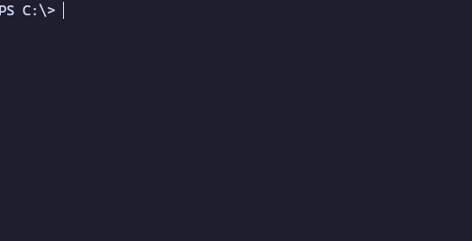

<div align="center">

# SecHack365-Omikuzi-CLI

SecHack365のおみくじ(非公式)



<br>
<br>
</div>

## ⬇️ インストール
```
go install github.com/PenguinCabinet/SecHack365-Omikuzi-CLI@latest
```

## 🔨 使い方

eキーでおみくじを確定します。

```bash
> SecHack365-Omikuzi  
SecHack345

Failure!
```

### 🥬 結果を八百長したい場合
```bash
> SecHack365-Omikuzi  --cracking-result 365
SecHack365

Success! Have nice 365 days!
```

## 🎫 LICENSE

[MIT](./LICENSE)

## ✍ Author

[PenguinCabinet](https://github.com/PenguinCabinet)
